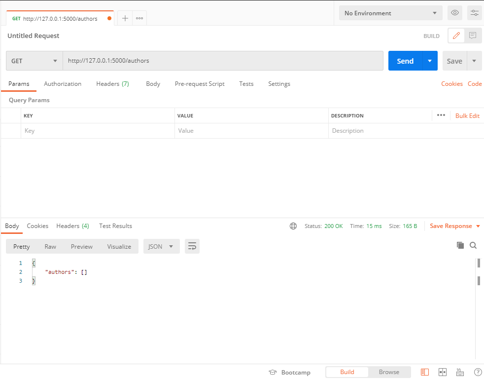

# Building APIS with Flask

## Table of Contents

- [Building APIS with Flask](#building-apis-with-flask)
  - [Table of Contents](#table-of-contents)
  - [Planning REST API](#planning-rest-api)
  - [Flask Rest Basic Architecture for CRUD API using MYSQL](#flask-rest-basic-architecture-for-crud-api-using-mysql)
    - [First Approach: GET method](#first-approach-get-method)
    - [Create Post endpoint](#create-post-endpoint)
    - [Get Author by ID route](#get-author-by-id-route)
    - [Put method](#put-method)
    - [Deled Author by ID](#deled-author-by-id)
    - [Final Code using SQL](#final-code-using-sql)
  - [Testing the same api using PostgreSQL](#testing-the-same-api-using-postgresql)

## Planning REST API

Here is a list of things we need to check while planning to create REST APIs:

1. Understanding the use case. It is really important to know why you are building the API and what services will the API provide.
2. Listing down API features to understand what all actions your APIs are going to do. This also includes listing down actions and grouping them together to tackle redundant endpoints.
3. Identify different platforms that’ll use the API and provide support accordingly.
4. Plan long term on supporting growth and scaling the infrastructure.
5. Plan API versioning strategy ensuring continuous support is maintained over different versions of the APIs.
6. Plan API access strategy, that is, authentication, ACL, and throttling.
7. Plan API documentation and testing.
8. Understand how to use hypermedia with your APIs.

So, these are the eight important things to ensure while planning you API and are really crucial for developing a stable, production-focused API system

[Return to table of contents](#table-of-contents)

## Flask Rest Basic Architecture for CRUD API using MYSQL

### First Approach: GET method

Create a file named `requirements.txt`

```
click==7.1.2
Flask==1.1.2
flask-marshmallow==0.14.0
Flask-SQLAlchemy==2.4.4
itsdangerous==1.1.0
Jinja2==2.11.3
MarkupSafe==1.1.1
marshmallow==3.10.0
marshmallow-sqlalchemy==0.24.2
PyMySQL==1.0.2
python-dotenv==0.15.0
six==1.15.0
SQLAlchemy==1.3.23
Werkzeug==1.0.1
```

Create the `main.py` file with basic configuration. 

```python
from flask import Flask, request, jsonifsy, make_response
# Manage SQL with python
from flask_sqlalchemy import SQLAlchemy

# marshmallow for data (De)Serialize 
from marshmallow_sqlalchemy import ModelSchema
from marshmallow import fields

# dotenv for manage Environment Variables
from dotenv import load_dotenv

# Environment Variables
MYSQL_USERNAME = os.getenv("MYSQL_USERNAME")
MYSQL_PASSWORD = os.getenv("MYSQL_PASSWORD")
MYSQL_HOST = os.getenv("MYSQL_HOST")
MYSQL_PORT = os.getenv("MYSQL_PORT")
MYSQL_DB = os.getenv("MYSQL_DB")

# DataBase Config
app.config['SQLALCHEMY_DATABASE_URI']=f'mysql+pymysql://{MYSQL_USERNAME}:{MYSQL_PASSWORD}@{MYSQL_HOST}:{MYSQL_PORT}/{MYSQL_DB}'
app.config["SQLALCHEMY_TRACK_MODIFICATIONS"] = False

db = SQLAlchemy(app)

app = Flask(__name__)

# Holds the schema for the authors table
class Authors (db.Model):
    id = db.Column(db.Integer, primary_key=True)
    name = db.Column(db.String(20))
    specialisation = db.Column(db.String(50))
    
    def __init__(self, name, specialisation):
        self.name = name
        self.specialisation = specialisation
    
		# __repr__ is the “official” built-in function to compute 
		# the string representation of an object, dont use __str__
		# enable string representacion <author_id: 1>, <author_id: 2> 
    def __repr__(self):
        return f'<author_id: {self.id}>'

# Instructs App to create all tables and database using 
# all clases that inherit from db.Model, no matter if there
# is no ModelSchema.
db.create_all()

# Schema uses Marshmellow to turn python data into json
# Serialize and viceversa for Deserialization, this help us
# return json from SQLAlchemy
class AuthorsSchema(ModelSchema):
    class Meta(ModelSchema.Meta):
				# Our previous model
        model = Authors
        sqla_session = db.session
		# maps variables attribute to field objects
    id = fields.Integer(dump_only=True)
    name = fields.String(required=True)
    specialisation = fields.String(required=True)

# Hello world test route
@app.route('/')
def hello_world():
    return 'Hello, From Flask!'

# First route, get all Authores
@app.route('/authors', methods = ['GET'])
def get_authors():
		# Query all Authors on db
    get_authors = Authors.query.all()
		# Instance our Schema
    author_schema = AuthorsSchema(many=True)
		# Serialize an object to native Python data types according 
		# to this Schema’s fields.
    authors = author_schema.dump(get_authors)
	  # Use jsonify to expose json as dictionary
    return make_response(jsonify({"authors": authors}))

if __name__ == '__main__':
    app.run()
```

[See __repr__ documentation](https://docs.python.org/3/reference/datamodel.html#object.__repr__)

`.env` for environment variables

```python
## Flask Config
FLASK_APP=main.py
FLASK_ENV=development

## Database Config
MYSQL_USERNAME=root
MYSQL_PASSWORD=toor
MYSQL_HOST=localhost
MYSQL_PORT=3306
MYSQL_DB=api-test
```

Now the first run for our API: `flask run`, use postman for testing the endpoints 



[Return to table of contents](#table-of-contents)

### Create Post endpoint

The first thing to do is Add  to the Class Authors the method ****that creates a new object with the data and then returns the created object.

```python
class Authors (db.Model):
    id = db.Column(db.Integer, primary_key=True)
    name = db.Column(db.String(20))
    specialisation = db.Column(db.String(50))
    
    def create(self):
        db.session.add(self)
        db.session.commit()
        return self

    def __init__(self, name, specialisation):
        self.name = name
        self.specialisation = specialisation
    
    def __repr__(self):
        return f'<author_id: {self.id}>'
```

Then create the route for post

```python
@app.route('/authors', methods = ['POST'])
def create_author():
    data = request.get_json()
    author_schema = AuthorsSchema()
    # Deserialize a data structure to an object 
    # defined by this Schema’s fields.
    author = author_schema.load(data)
    created_author = author_schema.dump(author.create())
    # author.create() creates the author on db using the schema
    # author_schema.dump turns object into python type 
    return make_response(jsonify({"author": created_author}),201)
```

The previous method will take the JSON request data, load the data in the marshmallow schema,  and then (with data as a python dict) call the create method we created in the Authors class which will return the created object with 201 status code.

[Documentation for Marshmellow load(data)](https://marshmallow.readthedocs.io/en/3.0/api_reference.html#marshmallow.Schema.load)

Send the POST request 


[Return to table of contents](#table-of-contents)

### Get Author by ID route

Add the following endpoint after get_authors

```python
@app.route('/authors/<id>', methods = ['GET'])
def get_author_by_id(id):
    get_author = Authors.query.get(id)
    author_schema = AuthorsSchema()
    author = author_schema.dump(get_author)
    return make_response(jsonify({"authors": author}))
```

Get by id on postman


[Return to table of contents](#table-of-contents)

### Put method

After post method we create the following code, PUT method will overwrite all the fields related with Authors table for an specific id.

```python
@app.route('/authors/<id>', methods = ['PUT'])
def update_author_by_id(id):
    data = request.get_json()
    get_author = Authors.query.get(id)
    
		# replace values on author dictionary
    if data.get('specialisation'):
        get_author.specialisation = data['specialisation']
    if data.get('name'):
        get_author.name = data['name']

		# Add author to db
    db.session.add(get_author)
	  # Save changes
		db.session.commit()
	  # Serialize data
		author_schema = AuthorsSchema(only=['id', 'name', 'specialisation'])
    author = author_schema.dump(get_author)
		
    return make_response(jsonify({"author": author}))
```

Try it on postman


[Return to table of contents](#table-of-contents)

### Deled Author by ID

Finnally add the next code after put to complete your first CRUD with Flask using rest arquitecture

```python
@app.route('/authors/<id>', methods = ['DELETE'])
def delete_author_by_id(id):
    get_author = Authors.query.get(id)
    db.session.delete(get_author)
    db.session.commit()
    return make_response(f"Author with id: {id}, was deleted",200)
```

[Return to table of contents](#table-of-contents)

### Final Code using SQL

```python
import os
from flask import Flask, request, jsonify, make_response
from flask_sqlalchemy import SQLAlchemy
from marshmallow_sqlalchemy import ModelSchema
from marshmallow import fields
from dotenv import load_dotenv

app = Flask(__name__)

# Environment Variables
MYSQL_USERNAME = os.getenv("MYSQL_USERNAME")
MYSQL_PASSWORD = os.getenv("MYSQL_PASSWORD")
MYSQL_HOST = os.getenv("MYSQL_HOST")
MYSQL_PORT = os.getenv("MYSQL_PORT")
MYSQL_DB = os.getenv("MYSQL_DB")

# DataBase Config
app.config['SQLALCHEMY_DATABASE_URI']=f'mysql+pymysql://{MYSQL_USERNAME}:{MYSQL_PASSWORD}@{MYSQL_HOST}:{MYSQL_PORT}/{MYSQL_DB}'
app.config["SQLALCHEMY_TRACK_MODIFICATIONS"] = False

db = SQLAlchemy(app)

class Authors (db.Model):
    id = db.Column(db.Integer, primary_key=True)
    name = db.Column(db.String(20))
    specialisation = db.Column(db.String(50))
    
    def create(self):
        db.session.add(self)
        db.session.commit()
        return self

    def __init__(self, name, specialisation):
        self.name = name
        self.specialisation = specialisation
    
    def __repr__(self):
        return f'<author_id: {self.id}>'

db.create_all()

class AuthorsSchema(ModelSchema):
    class Meta(ModelSchema.Meta):
        model = Authors
        sqla_session = db.session
    id = fields.Integer(dump_only=True)
    name = fields.String(required=True)
    specialisation = fields.String(required=True)

@app.route('/')
def hello_world():
    return 'Hello, From Flask!'

@app.route('/authors', methods = ['GET'])
def get_authors():
    get_authors = Authors.query.all()
    author_schema = AuthorsSchema(many=True)
    authors = author_schema.dump(get_authors)
    return make_response(jsonify({"authors": authors}))

@app.route('/authors/<id>', methods = ['GET'])
def get_author_by_id(id):
    get_author = Authors.query.get(id)
    author_schema = AuthorsSchema()
    author = author_schema.dump(get_author)
    return make_response(jsonify({"authors": author}))

@app.route('/authors', methods = ['POST'])
def create_author():
    data = request.get_json()
    author_schema = AuthorsSchema()
    # Deserialize a data structure to an object 
    # defined by this Schema’s fields.
    author = author_schema.load(data)
    created_author = author_schema.dump(author.create())
    # author.create() creates the author on db using the schema
    # author_schema.dump turns object into python type 
    return make_response(jsonify({"author": created_author}),201)

@app.route('/authors/<id>', methods = ['PUT'])
def update_author_by_id(id):
    data = request.get_json()
    get_author = Authors.query.get(id)
    
    if data.get('specialisation'):
        get_author.specialisation = data['specialisation']

    if data.get('name'):
        get_author.name = data['name']

    db.session.add(get_author)
    db.session.commit()
    author_schema = AuthorsSchema(only=['id', 'name', 'specialisation'])
    author = author_schema.dump(get_author)

    return make_response(jsonify({"author": author}))

@app.route('/authors/<id>', methods = ['DELETE'])
def delete_author_by_id(id):
    get_author = Authors.query.get(id)
    db.session.delete(get_author)
    db.session.commit()
    return make_response(f"Author with id: {id}, was deleted",200)

if __name__ == '__main__':
    app.run()
```

[Return to table of contents](#table-of-contents)

## Testing the same api using PostgreSQL

The only things that you have to change is this

`.env` file

```python
## Database Config POSTGRES 
POSTGRES_USERNAME=postgres
POSTGRES_PASSWORD=toor
POSTGRES_HOST=localhost
POSTGRES_PORT=5433
POSTGRES_DB=api-test
```

main.py db configuration

```python
# Environment Variables
POSTGRES_USERNAME = os.getenv("POSTGRES_USERNAME")
POSTGRES_PASSWORD = os.getenv("POSTGRES_PASSWORD")
POSTGRES_HOST = os.getenv("POSTGRES_HOST")
POSTGRES_PORT = os.getenv("POSTGRES_PORT")
POSTGRES_DB = os.getenv("POSTGRES_DB")

# DataBase Config
app.config['SQLALCHEMY_DATABASE_URI']=f'postgresql+psycopg2://{POSTGRES_USERNAME}:{POSTGRES_PASSWORD}@{POSTGRES_HOST}:{POSTGRES_PORT}/{POSTGRES_DB}'
app.config["SQLALCHEMY_TRACK_MODIFICATIONS"] = False
```

Thats all, make a test with Postman, everything should works fine

[Return to table of contents](#table-of-contents)
